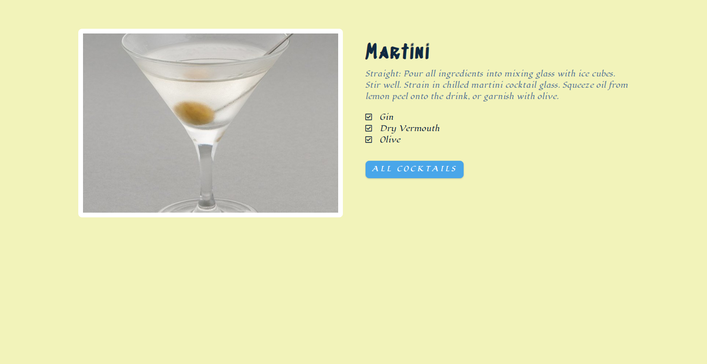

# **Drink Up! - Cocktail Search Application**

---

## **Project Overview**

Welcome to Drink Up! - Cocktail Search Application. This web-based platform is designed to allow users to search for cocktails easily and efficiently using an external Cocktails API. Whether you're looking for a classic martini recipe or exploring new and exotic concoctions, Drink Up! has you covered. Dive into the world of mixology and discover your next favorite drink!

**index.html**


**drink.html**



---

## **Schema Design**

The core entity of our application is the Cocktail, which has the following attributes:

- Cocktail ID (Primary Key)
- Name
- Image URL
- Ingredients
- Instructions

This schema design ensures that we can search and display detailed information about each cocktail, making it easier for users to find what they're looking for. We leverage technologies like HTML, CSS, Vanilla JavaScript, and an external Cocktails API (such as TheCocktailDB API) to provide a seamless and user-friendly experience.

---

## **Coding User Flows**

Here's a brief overview of the implementation steps for the Drink Up! application:

1. ### **Set Up Project Structure**:

   - Create necessary folders and files (index.html, style.css, app.js).
   - Initialize a Git repository for version control.
2. ### **Design User Interface (UI)**:

   - Create a search form for cocktail name search.
   - Design the results display section to show cocktail names and images.
   - Include forms or modals for searching and selecting cocktails.
3. ### **Fetch API Data**:

   - Use app.js to fetch data from the Cocktail API using Asynchronous JavaScript (i.e. async, await, try, catch).
   - Handle API responses and errors appropriately.
4. ### **Display Results**:

   - Render the fetched data on the results display section in index.html.
5. ### **Handle Click Events**:

   - Implement event listeners for fetched data results and then upon clicking, display section of single drink in drink.html.

---

## **Getting Started**

1. Clone the repository to your local machine:

   ```
   git clone https://github.com/HaykeesComet/CocktailsAPI.git
   ```
2. Open the project directory:

   ```
   cd CocktailsAPI
   ```
3. Launch the application by opening index.html in your web browser.

---

## **Contributing**

We welcome contributions to improve Drink Up! Feel free to fork the repository, make your changes, and submit a pull request.

---

## **Credits**

This project utilizes the following technologies and resources:

- HTML, CSS, Vanilla JavaScript
- TheCocktailDB API (or similar)
- Fonts from Google Fonts
- Icons from FontAwesome

---

Thank you for using Drink Up! We hope you enjoy exploring and discovering exciting cocktail recipes. Cheers! 🍹
